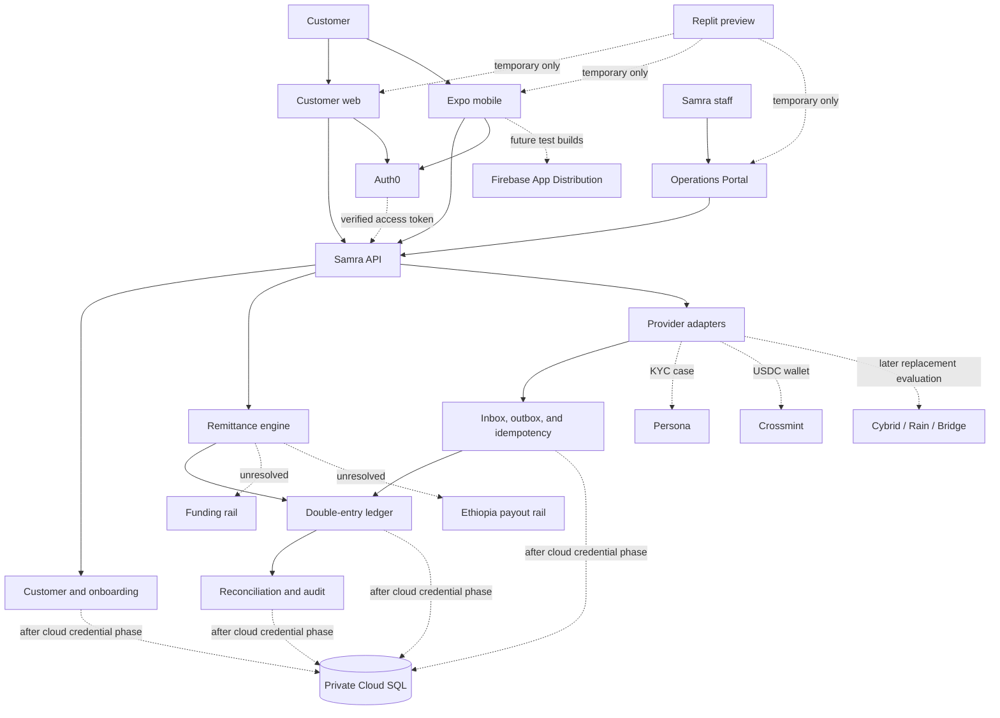

# Alpha platform and vendor boundary

## Decision

The Alpha vendor stack is Auth0 for customer authentication, Persona for KYC,
and Crossmint for creation of a USDC wallet. Samra Pay owns the customer,
onboarding state, consent evidence, authorization, provider mappings,
transactions, double-entry ledger, balances, audit history, reconciliation,
support record, and acquisition attribution.

Crossmint is not the bank-funding or Ethiopia-payout decision. The architecture
must not imply Plaid compatibility, bank-funded Crossmint transactions, a live
ETB corridor, or an approved remitter-of-record structure.

Cybrid, Rain, and Bridge are post-Alpha alternatives. They are not active
vendors and must remain behind the same provider-neutral wallet contract.

## System landscape

Web, mobile, and operations clients use the Samra API. They do not call a
financial vendor to obtain balance or transaction truth. Vendor webhooks enter
through authenticated adapters, are persisted before processing, and cannot
grant customer capability or post a ledger journal by themselves.

## Capability ownership

| Capability | Authority | Samra retains |
| --- | --- | --- |
| Authentication | Auth0 authenticates a configured subject | Customer mapping, lifecycle, authorization, audit |
| KYC evidence | Persona may collect and evaluate evidence | Case ID, normalized state, capability gate, appeal/support state |
| USDC wallet | Crossmint may create and operate the Alpha wallet | Internal wallet ID, customer link, state, provider mapping, ledger |
| Funding | Unresolved provider | Funding intent, idempotency, transaction and ledger state |
| Ethiopia payout | Unresolved provider | Transfer state, payout instruction, evidence, reconciliation |
| Balance | Samra ledger only | Journals, postings, holds, projection, reconciliation |
| Testing evidence | GitHub Actions and Qase | Release decision, exact SHA, evidence retention |
| Runtime and data | Google Cloud | Source, configuration contracts, access policy, database schema |

## Integration sequence

1. Auth0 authenticates the customer and returns an access token for the exact
   Samra API audience.
2. The API validates the token and resolves or creates the Samra customer and
   onboarding aggregate under the documented gate.
3. The customer records versioned consent.
4. The API starts or resumes the Samra identity case and calls Persona through
   the provider-neutral identity adapter.
5. A normalized approved decision advances onboarding but grants no financial
   capability by itself.
6. The API creates or resumes one Samra wallet record and calls Crossmint using
   a stable idempotency reference.
7. The Crossmint wallet reference is attached to the Samra wallet exactly once.
8. Activation occurs only after the required identity and wallet evidence is
   durable. Funding and remittance remain blocked until their rails are approved.

## Vendor portability rules

- Internal IDs are Samra-generated UUIDs; vendor IDs are opaque mappings.
- Frontend contracts expose normalized Samra states, never vendor payloads.
- Every create or command uses a stable Samra idempotency reference.
- Webhooks are authenticated, persisted, deduplicated, normalized, and applied
  under a Samra transaction boundary.
- Provider payloads do not become the ledger, audit metadata, analytics, or
  customer profile.
- A vendor outage cannot trigger mock fallback in API mode.
- No document may promise cryptographic wallet portability. A future change may
  require a new wallet, customer consent, compliant balance transfer, and
  preserved old-provider evidence.

## Crossmint Alpha boundary

The Alpha contract is limited to an approved USDC wallet configuration and the
minimum lifecycle needed to create, retrieve, suspend, and observe that wallet.
The exact network, custody model, recovery model, transaction permissions,
fees, limits, sanctions responsibilities, webhook authentication, and customer
disclosures must be confirmed before a live credential is introduced.

Crossmint is not assumed to provide Plaid connectivity or bank-funded wallet
transactions. Funding remains a separate capability and decision.

## Hard stops

Do not enable a live vendor or customer capability when any of these remain
unresolved:

- no approved Auth0, Persona, or Crossmint account and environment inventory;
- no exact web, mobile, server, webhook, callback, and logout configuration;
- no approved PII purpose, retention, deletion, access, and incident policy;
- no verified provider idempotency, signature, replay, timeout, and recovery
  contract;
- no written Crossmint USDC network, custody, recovery, limits, fees, and exit
  terms;
- no approved funding, payout, remitter-of-record, settlement, refund, and
  reconciliation responsibility map;
- any client or vendor response can directly set a balance, KYC capability,
  transfer state, or ledger result;
- any credential, token, PII, or provider payload appears in Git, Qase,
  analytics, screenshots, or ordinary application logs.
