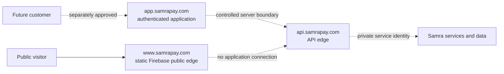

# Public and product surface boundary

Status: approved architecture boundary. Only the public `www` surface is
deployed. The customer application and API hosts are planned; this document
does not authorize DNS, infrastructure, traffic, customer data, or vendor
activation.

## Host ownership

| Host               | Responsibility                                                      | Runtime                                              | Current state         |
| ------------------ | ------------------------------------------------------------------- | ---------------------------------------------------- | --------------------- |
| `samrapay.com`     | Redirect to the canonical public site                               | DNS and managed HTTPS redirect                       | Deployed              |
| `www.samrapay.com` | Marketing, product information, legal content, and public discovery | Static Firebase Hosting release                      | Deployed              |
| `app.samrapay.com` | Authenticated customer web application                              | Separate customer-web release                        | Planned, not deployed |
| `api.samrapay.com` | Controlled server API edge and verified partner callbacks           | Separate server release in front of private services | Planned, not deployed |

The `api.samrapay.com` name does not authorize unrestricted public Cloud Run
ingress or direct database access. The private Cloud Run service-identity and
server-side authorization design remains the governing application boundary.

## Permanent public-edge controls

The current `www` work is retained when the financial product launches:

- canonical-domain redirects, managed TLS, DNSSEC, and email-DNS preservation;
- static Hosting, content-hashed assets, immutable asset caching, and route
  HTML revalidation;
- public security headers, a static-only Content Security Policy, accessibility,
  legal, English, Amharic, SEO, and performance gates;
- public-bundle isolation, secret scanning, exact-SHA releases, independent
  post-deploy verification, and recorded rollback evidence.

The public site remains independently deployable. A failure or rollback of the
customer application must not require rebuilding or replacing `www`.

## Controls that stay specific to `www`

The public release keeps `form-action 'none'`, no customer authentication, no
runtime API configuration, no customer financial data, and no financial vendor
SDKs. The September 2 amendment replaces `connect-src 'none'` with exact GA4
origins for consent-gated public analytics only. Advertising endpoints remain
blocked. See [the analytics boundary](../operations/public-website-analytics.md).
These controls are not copied unchanged to the future application; `app`
requires its own reviewed allowlist and release approval.

Adding a public form, analytics provider, runtime endpoint, or third-party
script is a separate public-edge change. It requires a documented purpose,
explicit host allowlist, data classification, retention owner, security review,
tests, and release approval.

## Future application and API gates

The planned application and API require separate:

1. DNS, managed TLS, deployment identity, release, rollback, and monitoring;
2. Content Security Policy and network allowlists limited to the exact Auth0,
   Samra API, and approved vendor origins required by that surface;
3. server-side authentication, Samra authorization, rate limits, webhook
   verification, audit evidence, secret management, and data controls;
4. Auth0 activation before Persona, and Persona approval before wallet
   activation or any financial capability;
5. synthetic staging evidence before production customer data or traffic.

Auth0 proves an external session. It does not create a Samra customer, approve
KYC, grant a financial capability, or authorize a client-supplied customer ID.
Persona and wallet providers remain adapters behind Samra-owned state,
authorization, ledger, reconciliation, and audit controls.

## Change discipline

- Do not replace `www` with the authenticated application.
- Do not weaken the public CSP to prepare for a future application.
- Do not share browser bundles, secrets, deployment identities, or rollback
  targets across the public, application, and API surfaces.
- Do not create `app` or `api` DNS records before the exact target is bound and
  ready; remove DNS before retiring a target to prevent subdomain takeover.
- Treat each activation as a reviewed PR, controlled apply, independent
  post-audit, and separately authorized traffic decision.
