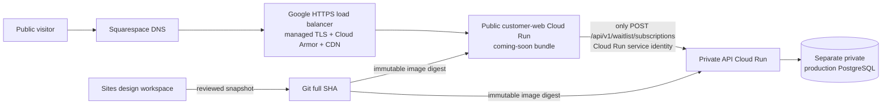

# Coming-soon Google Cloud launch

## Decision

Launch the public DS2 coming-soon site before Auth0, Persona, Crossmint, or the
transaction product. Ongoing Sites edits do not block engineering. Sites is the
design workspace; a refreshed, reviewed snapshot becomes a Git commit, and the
immutable Git commit becomes the Google Cloud release.

The bounded production project, billing link, USD 25 alert, and read-only
preflight trust now exist. This runbook does not authorize workload
infrastructure, database spend, deployment, public traffic, waitlist data
collection, vendors, or Squarespace DNS changes. Those decisions remain
explicit gates in `deploy/gcp/coming-soon-launch.json`.

## Launch topology



The browser never receives a database credential or calls the private API
directly. The public web service strips client-supplied service authorization,
uses its short-lived Google identity to invoke the private API, and refuses to
proxy every API route except the waitlist submission. Auth, KYC, wallet, and
financial routes stay dormant.

## Source and copy workflow

1. David continues UI and copy edits in Sites.
2. Engineering can change data, security, deployment, tests, and API behavior
   independently in Git.
3. At the cutover gate, capture the newest Sites version and compare it with the
   pinned snapshot in the launch contract.
4. Sync only reviewed public UI and copy changes. Do not overwrite the waitlist
   client, API, database, build boundary, or deployment controls.
5. Re-run public tests, type checks, production build, visual QA, API tests,
   database tests, container tests, and the launch-contract validator.

## Waitlist data boundary

The form requires explicit, unchecked consent. It stores the normalized email,
email hash, consent state and notice version, locale, hashed idempotency key,
request fingerprint, and server timestamp. It does not submit attribution,
device, referral URL, Auth0, Persona, Crossmint, or financial data with the
email. Acquisition telemetry remains a separate record and purpose boundary.

Production waitlist data must not enter the synthetic staging database. The
production project, private PostgreSQL target, pinned Secret Manager version,
retention policy, deletion procedure, and access owner must be approved before
the first public submission.

## Release and rollback

1. Re-verify the existing `samra-pay-production` project (`382465561715`) in
   `us-east4`, its budget, billing, domain, and data boundaries. The staging
   project is not eligible.
2. Build the customer web, API, and migration images from one full Git SHA.
   Record each digest; do not deploy a floating tag.
3. Apply the waitlist migration once through the dedicated migration identity.
4. Deploy the API and web revisions with zero traffic. Keep the API private.
5. Prove readiness, English and Amharic routes, legal pages, one synthetic
   waitlist submission, and denial of every other public API route.
6. Record the currently healthy web and API revisions as rollback targets.
7. Promote the exact candidate revisions, verify the custom domain, and watch
   uptime, 5xx, latency, database, and waitlist-acceptance alerts.
8. If a gate fails, restore the recorded prior revisions without rebuilding.

## Production foundation preflight

Run the local plan before creating or changing any production resource:

```sh
bash deploy/gcp/review-coming-soon-production.sh --plan
```

The plan reads no cloud or DNS state. The verified boundary is project
`samra-pay-production` (`382465561715`), organization `614833350075`, region `us-east4`,
`customer-pii` data classification, apex `samrapay.com`, canonical
`www.samrapay.com`, the same billing account as `samra-pay-staging`, and a USD
25 monthly budget alert. The project, labels, exact billing-account match, and
budget passed independent read-only review. No workload or DNS state changed.

The keyless controller uses a dedicated production auditor, project-scoped
budget access, and only `resourcemanager.projects.get` on staging. It grants no
billing-account role. Its one-time zero-cost trust bootstrap and independent
audit are complete. The offline recovery plan remains:

```sh
bash deploy/gcp/activate-production-foundation-preflight.sh --plan
```

The manual `Production foundation preflight` workflow passed from `main` at
`22e7d644c25d169532018534fa25ce8b6801744a` through the protected
`production-foundation-review` environment in run `33334655501`. Its retained
evidence checksum is
`083bd82259bd54f5fab76ef08f9fab5701a45d59fcd6611d7ea5231b9a66d48b`. A later
repository transfer to the Enterprise organization requires the OIDC trust
condition to be reissued before authentication resumes.

The budget must be scoped only to the production project, use USD, equal USD
25, and include 50%, 90%, and 100% notification thresholds. A Google Cloud
budget is an alert, not a spending cap. A successful review authorizes nothing:
infrastructure, the production database, deployment, traffic, waitlist
collection, Auth0, Persona, Crossmint, and Squarespace DNS remain separate
gates.

## Production foundation plan

After the preflight contract, review the bounded foundation locally:

```sh
bash deploy/gcp/plan-coming-soon-production-foundation.sh --plan
```

This second plan also reads no cloud or DNS state and costs USD 0. It fixes the
foundation scope to 15 approved APIs, one regional immutable
`samra-production` image repository, five dedicated keyless identities,
least-privilege IAM, and separate empty runtime and migration secret metadata.
The plan entrypoint has no `--apply` mode.

The separate activation controller is implemented but unapplied. Its live
review must run from one clean exact source SHA and the exact human
administrator:

```sh
SAMRA_GCP_OPERATOR_ACCOUNT="me@davidhaile.com" \
SAMRA_GCP_EXPECTED_SHA="$(git rev-parse HEAD)" \
  bash deploy/gcp/activate-coming-soon-production-foundation.sh --review
```

The review inventories every targeted API, label, repository, service account,
project and resource IAM binding, secret metadata record, user-managed key, and
secret version. Existing exact state is reusable; absent state is resumable;
drift fails closed. The apply sentinel is accepted only after this review. A
separate read-only post-audit is mandatory. No GitHub apply workflow exists.

The foundation explicitly excludes the project, billing link, budget, VPC,
Cloud SQL, secret values, Cloud Run, load balancer, certificate, public traffic,
waitlist data, vendors, and DNS. The project ID, region, data classification,
budget-alert amount, billing source, apex domain, and canonical host are locked
in the plan. The project number, same-account billing match, and exact budget
are verified. Private API invocation IAM is correctly deferred until the API
service exists. The remaining blocker is a separately reviewed and authorized
infrastructure foundation apply.

## Production project, billing, and budget controller

The controller phase is applied and independently verified. Keep its local plan
as a fail-closed recovery reference:

```sh
bash deploy/gcp/provision-coming-soon-production-project.sh --plan
```

The local plan costs USD 0 and reads no Google Cloud or DNS state. The recovery
controller is idempotent: it reuses exact state and rejects any project,
billing, or budget drift. It cannot enable an API, create infrastructure,
deploy, route traffic, collect data, activate vendors, or change Squarespace
DNS. The production foundation, database, deployment, traffic, and DNS remain
later gates.

## Squarespace DNS cutover

Squarespace remains the registrar and DNS owner. Do not transfer the domain.
After Google assigns the verified load-balancer endpoint and the certificate is
ready, lower only the affected web-record TTL, point `www`, verify HTTPS and the
waitlist end to end, then point the apex. Preserve MX, TXT, SPF, DKIM, DMARC,
and unrelated verification records exactly. DNS changes require a separate
authorization at the action boundary.

## Remaining launch decisions

- production infrastructure foundation apply;
- production PostgreSQL cost and data-retention approval;
- final privacy notice and consent language;
- final refreshed Sites snapshot and desktop/mobile visual approval;
- Cloud Armor thresholds, alert recipients, rollback owner, and launch window;
- explicit authorization for infrastructure apply, public traffic, and DNS.

Auth0 follows the coming-soon launch. Persona follows Auth0. Wallet
infrastructure follows identity and KYC. None of those vendor activations needs
to be rebuilt because the public launch keeps them behind independent adapters
and approval gates.
