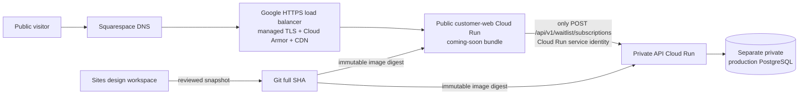

# Coming-soon Google Cloud launch

## Decision

Launch the public DS2 coming-soon site before Auth0, Persona, Crossmint, or the
transaction product. Ongoing Sites edits do not block engineering. Sites is the
design workspace; a refreshed, reviewed snapshot becomes a Git commit, and the
immutable Git commit becomes the Google Cloud release.

This runbook is preparation only. It does not authorize production resources,
cloud spend, public traffic, waitlist data collection, or Squarespace DNS
changes. Those decisions remain explicit gates in
`deploy/gcp/coming-soon-launch.json`.

## Launch topology



The browser never receives a database credential or calls the private API
directly. The public web service strips client-supplied service authorization,
uses its short-lived Google identity to invoke the private API, and refuses to
proxy every API route except the waitlist submission. Auth, KYC, wallet, and
financial routes stay dormant.

## Source and copy workflow

1. David continues UI and copy edits in Sites.
2. Engineering can change data, security, deployment, tests, and API behavior
   independently in Git.
3. At the cutover gate, capture the newest Sites version and compare it with the
   pinned snapshot in the launch contract.
4. Sync only reviewed public UI and copy changes. Do not overwrite the waitlist
   client, API, database, build boundary, or deployment controls.
5. Re-run public tests, type checks, production build, visual QA, API tests,
   database tests, container tests, and the launch-contract validator.

## Waitlist data boundary

The form requires explicit, unchecked consent. It stores the normalized email,
email hash, consent state and notice version, locale, hashed idempotency key,
request fingerprint, and server timestamp. It does not submit attribution,
device, referral URL, Auth0, Persona, Crossmint, or financial data with the
email. Acquisition telemetry remains a separate record and purpose boundary.

Production waitlist data must not enter the synthetic staging database. The
production project, private PostgreSQL target, pinned Secret Manager version,
retention policy, deletion procedure, and access owner must be approved before
the first public submission.

## Release and rollback

1. Resolve the production project, region, budget, public domain, and data
   owner. The staging project is not eligible.
2. Build the customer web, API, and migration images from one full Git SHA.
   Record each digest; do not deploy a floating tag.
3. Apply the waitlist migration once through the dedicated migration identity.
4. Deploy the API and web revisions with zero traffic. Keep the API private.
5. Prove readiness, English and Amharic routes, legal pages, one synthetic
   waitlist submission, and denial of every other public API route.
6. Record the currently healthy web and API revisions as rollback targets.
7. Promote the exact candidate revisions, verify the custom domain, and watch
   uptime, 5xx, latency, database, and waitlist-acceptance alerts.
8. If a gate fails, restore the recorded prior revisions without rebuilding.

## Production foundation preflight

Run the local plan before creating or changing any production resource:

```sh
bash deploy/gcp/review-coming-soon-production.sh --plan
```

The plan reads no cloud or DNS state. After the separate production project,
billing relationship, labels, and monthly budget have been explicitly approved
and created, `--review` can verify them without changing them. The review is
bound to the exact active administrator, project ID and number, organization,
region, non-synthetic data classification, whole-dollar monthly budget, apex
domain, canonical `www`-or-apex choice, and full Git SHA.

The budget must be scoped only to the production project, use USD, match the
approved amount, and include 50%, 90%, and 100% alert thresholds. A Google
Cloud budget is an alert, not a spending cap. A successful review authorizes
nothing: infrastructure, the production database, deployment, traffic,
waitlist collection, Auth0, Persona, Crossmint, and Squarespace DNS remain
separate gates.

## Squarespace DNS cutover

Squarespace remains the registrar and DNS owner. Do not transfer the domain.
After Google assigns the verified load-balancer endpoint and the certificate is
ready, lower only the affected web-record TTL, point `www`, verify HTTPS and the
waitlist end to end, then point the apex. Preserve MX, TXT, SPF, DKIM, DMARC,
and unrelated verification records exactly. DNS changes require a separate
authorization at the action boundary.

## Remaining launch decisions

- production Google Cloud project ID, number, billing owner, budget, and region;
- exact public domain and whether apex or `www` is canonical;
- production PostgreSQL cost and data-retention approval;
- final privacy notice and consent language;
- final refreshed Sites snapshot and desktop/mobile visual approval;
- Cloud Armor thresholds, alert recipients, rollback owner, and launch window;
- explicit authorization for infrastructure apply, public traffic, and DNS.

Auth0 follows the coming-soon launch. Persona follows Auth0. Wallet
infrastructure follows identity and KYC. None of those vendor activations needs
to be rebuilt because the public launch keeps them behind independent adapters
and approval gates.
