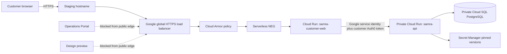

# Staging public edge, observability, and acquisition activation

Status: architecture and fail-closed controls prepared; no public endpoint,
DNS change, certificate, alert, campaign, vendor connection, or traffic
activation is authorized by this document.

The machine authority is
[`deploy/gcp/staging-public-readiness.json`](../../deploy/gcp/staging-public-readiness.json).
Its validator runs entirely offline and is part of the Google Cloud platform
test suite.

## Decision

Expose only the customer website through a Google Cloud external HTTPS load
balancer. Keep the API private behind the customer-web same-origin proxy. Keep
the Operations Portal and design-system preview private. Squarespace remains
only the DNS registrar/manager when a staging hostname is chosen; it is not an
application runtime.

This design does not depend on Replit, Auth0, Persona, Crossmint, or a GitHub
owner name. The repository's stable numeric ID is the durable source identity.
The current personal owner and future Enterprise organization are selected by
the existing Enterprise migration contract. A repository transfer therefore
requires workload-identity rebinding and audits, not rebuilt Cloud Run images,
load-balancer resources, databases, application code, or customer records.

## Target topology



The public browser may reach `/` and `/api/*` only through the customer-web
backend. The web container strips any client-supplied Google service identity
header, obtains a short-lived audience-bound token from the Cloud Run metadata
service, preserves the customer's Auth0 bearer token separately, and proxies
to the private API. This keeps browser cookies first-party without creating a
public API origin.

## Required Cloud Run transition

The current zero-traffic runtime contract correctly requires Cloud Run IAM for
every service. A public browser cannot present a Google Cloud Run identity to
the customer-web service. First public staging traffic therefore requires one
separate reviewed runtime change:

- disable the invoker IAM check for `samra-customer-web` only;
- retain `internal-and-cloud-load-balancing` ingress;
- keep the default `run.app` URL disabled;
- permit public access only through the load balancer and Cloud Armor;
- retain Cloud Run IAM on `samra-api` and the service-to-service proxy;
- retain authentication on customer routes according to the Auth0 policy; and
- keep `samra-operations-web` and `samra-design-system-preview` off the public
  edge.

This is not an authorization to make that change. It records the technically
necessary boundary so a future activation does not weaken the API or workforce
surfaces by accident.

## Transport, cache, and browser controls

Before DNS cutover, the load balancer must have a reserved global address, an
active Google-managed certificate for the exact staging hostname, HTTPS-only
routing, and a Cloud Armor policy. HTTP redirects to HTTPS. HSTS is enabled only
after the certificate and HTTPS path are verified; staging does not request
preload or claim control over sibling subdomains.

The customer-web server now supports runtime-only controls:

| Setting                              | Staging value at activation | Purpose                                                                      |
| ------------------------------------ | --------------------------- | ---------------------------------------------------------------------------- |
| `SAMRA_PUBLIC_HTTPS_ONLY`            | `true`                      | Adds bounded HSTS after TLS verification                                     |
| `SAMRA_PUBLIC_SEARCH_INDEXING`       | `disabled`                  | Adds `noindex`, `nofollow`, and `noarchive`                                  |
| `SAMRA_PUBLIC_ACQUISITION_CAMPAIGNS` | empty until approved        | Enables only explicit normalized campaign slugs without rebuilding the image |

HTML, health responses, runtime configuration, and all proxied API responses
are `no-store`. Only fingerprinted static assets receive a one-year immutable
cache policy. The same-origin API proxy rejects request bodies larger than 1 MiB
before they reach the private API. Security headers deny framing, MIME sniffing,
camera, microphone, and geolocation access and retain popup-compatible opener
isolation for Auth0.

## Observability before traffic

The public probe calls `GET /healthz` every five minutes, expects HTTP 200 and
`{"status":"ok"}`, and is forbidden from creating a customer, querying the
database, or calling a real provider. Private API readiness remains an
exact-revision, service-authenticated probe through the existing deployment
control plane.

Required alerts cover:

- public availability below 99% over 15 minutes;
- load-balancer 5xx ratio above 2% over 10 minutes;
- customer-web p95 latency above 2.5 seconds over 15 minutes;
- Cloud SQL disk utilization above 80%;
- Cloud SQL connection utilization above 80%; and
- the latest successful database backup becoming more than 26 hours old.

Notification channel resource IDs must be supplied at activation. Email
addresses or other destinations are not stored in the repository. Runtime logs
may include a request ID, trace ID, service, revision, candidate SHA, status,
and latency. They must never include an authorization header, cookie, query
string, request body, PII, identity evidence, provider payload, or secret.
Runtime logs retain for 30 days; immutable release evidence remains 365 days.

## Acquisition activation

The owned acquisition system already has append-only PostgreSQL sessions,
events, authenticated customer binding, first-touch and last-non-direct
attribution, and canonical milestones through a fifth completed remittance. It
does not need an analytics vendor to operate.

Campaign capture is now runtime-configurable but remains disabled because the
active allowlist is empty. The server accepts at most 50 unique lowercase slugs
and rejects malformed, duplicate, or excessive configuration. The browser
accepts only that validated allowlist. Unknown campaign values become `null`;
raw URLs and arbitrary campaign names are not retained.

Activation still requires:

1. an approved privacy notice and lawful basis;
2. retention, deletion, and data-subject request procedures;
3. a campaign taxonomy owner and change-control record;
4. a cross-domain and mobile attribution decision;
5. Cloud Armor rate limiting and bot controls;
6. application request-body, idempotency, and replay controls;
7. failure and rejection alerting; and
8. a separate contract before any marketing, analytics, CMS, or messaging
   vendor receives an export.

The reporting endpoint remains aggregate and workforce-protected. Marketing
tools may later receive a limited outbound copy, but they never define Samra's
customer, identity, transfer, ledger, or five-send truth.

## Controlled activation order

1. Confirm the exact staging customer hostname and DNS owner.
2. Approve the incremental Google Cloud estimate and budget alert.
3. Complete or explicitly defer the Enterprise repository cutover and select
   the active repository authority.
4. Create edge resources without changing DNS.
5. Verify the load balancer and managed certificate.
6. Configure exact Auth0 callbacks, logout URLs, and allowed origins.
7. Activate notification channels, uptime checks, and alerts.
8. Pass public-edge, private-API, accessibility, narrow-screen, failure, and
   rollback tests using synthetic data.
9. Approve privacy, taxonomy, retention, and abuse controls.
10. Separately authorize first public staging traffic.
11. Change DNS and retain evidence.
12. Observe the rollback window before enabling campaign attribution.

Cloud creation, DNS, traffic, Auth0, Persona, Crossmint, production data, and
provider calls are hard stops until their specific action boundary is reviewed
and authorized.

## Offline evidence

Run the focused review without Google Cloud access:

```sh
node --test deploy/gcp/staging-public-readiness.test.mjs \
  deploy/gcp/static-server.test.mjs \
  deploy/gcp/runtime-contract.test.mjs

node deploy/gcp/validate-staging-public-readiness.mjs
```

The validator must end with `NO CLOUD, DNS, OR VENDOR CHANGES`.
