# Staging release control plane

## Decision

Samra Pay uses GitHub as the source and approval authority, Google Cloud Build
as the image builder, Artifact Registry as the immutable image store, Cloud Run
as the future runtime, and Qase as governed test evidence. These systems are
connected by exact identifiers. None of them may infer that a build, deployment,
test, traffic change, or vendor activation authorizes the next stage.

Image publication, zero-traffic deployment, verification evidence recording,
exact-revision promotion, rollback, and immutable deployment-history
controllers are implemented. The live exact-revision probe is not implemented
or authorized. Its future output must satisfy the recorder before promotion can
consume it. Federated identities, protected environments, and every Cloud Run
mutation remain separately activated and authorized; no service is live. The
promotion path deliberately cannot perform first-ever activation because a
release without a prior healthy revision has no proven rollback target.

## Controlled delivery path

```mermaid
flowchart LR
  A[Exact main commit] --> B[GitHub release gates]
  B --> C[Qase release identity]
  B --> D[Protected image publication]
  D --> E[Google Cloud Build]
  E --> F[Five immutable image digests]
  F --> G[Hashed publication manifest]
  G -. separate approval .-> H[Private zero-traffic revisions]
  H -. future live probe .-> I[Hashed probe evidence]
  I --> L[Validated verification record]
  L -. protected promotion .-> J[Exact revision receives 100 percent]
  J -. protected rollback .-> K[Recorded prior revision restored]
```

Solid arrows are implemented evidence flow. Dashed arrows are controlled stages
that still require activation or evidence. The verification contract and
tamper-evident recorder are implemented; the live probe that must observe the
exact deployed revision is not. No traffic workflow is authorized.

## Stage authority

| Stage                   | Authority                      | Mutation                                                                       | Required evidence                                                                                                 | Current state                                                                                |
| ----------------------- | ------------------------------ | ------------------------------------------------------------------------------ | ----------------------------------------------------------------------------------------------------------------- | -------------------------------------------------------------------------------------------- |
| Release candidate       | GitHub Actions                 | None                                                                           | Exact `main` SHA, passing gates, Qase release identity                                                            | Implemented                                                                                  |
| Image publication       | Protected GitHub environment   | Cloud Build record and five immutable images                                   | Git SHA, Git tree, GitHub run, Cloud Build ID, five digests, manifest hash                                        | Implemented                                                                                  |
| Zero-traffic deployment | Protected GitHub environment   | One new private Cloud Run revision at 0% traffic                               | Approved manifest, same-release prerequisite evidence, configuration hash, revision name, unchanged-traffic proof | Implemented; not activated or authorized                                                     |
| Staging verification    | Future controlled test run     | Synthetic test traffic only                                                    | Exact-image synthetic suite, exact revision attestation, private network path, service authentication, Qase run   | Exact-image runner and partial recorder implemented; execution and live probe not authorized |
| Traffic promotion       | Protected GitHub environment   | Traffic moves from one healthy revision to one exact verified revision at 100% | Hashed deployment and verification evidence, Qase run, exact before/after traffic, rollback target                | Implemented; not activated or authorized                                                     |
| Rollback                | Separate protected environment | Traffic returns to the immutable revision recorded by promotion                | Hashed promotion record, reason, exact before/after traffic, pending post-rollback verification                   | Implemented; not activated or authorized                                                     |

Building is not deployment. Deployment is not promotion. Passing tests is not
vendor activation. Each transition requires its own bounded authorization.

## Immutable publication evidence

`publish-staging-images.sh` creates the images and then calls
`record-staging-image-publication.mjs`. The recorder will fail unless all of the
following describe one release:

- full candidate Git SHA and Git tree SHA;
- private repository and `refs/heads/main` identity;
- GitHub workflow run ID, attempt, actor, and protected environment when GitHub
  performs the publication;
- regional Cloud Build UUID and dedicated keyless build identity;
- exact staging project, region, and immutable Artifact Registry repository;
- one immutable digest for each of the API, customer web, Operations Portal,
  design preview, and migrations images.

It writes:

- `artifacts/staging-release/staging-image-publication.json`; and
- `artifacts/staging-release/staging-image-publication.sha256`.

The protected publication workflow uploads both files as a GitHub artifact named
with the full commit, workflow run, and attempt. Retention is 365 days. The
manifest explicitly records that deployment, traffic, and vendor activation are
not authorized.

## Zero-traffic deployment controller

`deploy-staging-zero-traffic.sh` consumes an independently verified publication
manifest and deploys only by immutable digest. It is limited to one service per
manual run and must:

- create private Cloud Run revisions for API, customer web, and design preview;
- use dedicated runtime identities and separate deployment federation;
- set new revisions to 0% traffic;
- disable default service URLs where the approved ingress design permits it;
- keep public unauthenticated IAM absent;
- pin secret versions rather than using `latest`;
- record a redacted configuration hash, prerequisite evidence, revision name,
  and byte-for-byte traffic snapshots;
- fail closed when Auth0 staging configuration or customer-web service
  authentication is incomplete.

The API additionally requires a hashed, same-candidate migration manifest.
Customer web additionally requires the API's hashed, same-candidate zero-traffic
deployment manifest. The design-system preview is the only service without a
runtime-service prerequisite. These gates prevent a later-stage deployment from
silently skipping database or API sequencing.

The controller writes a deployment manifest and SHA-256 sidecar. That record
binds the image-publication hash, exact digest, configuration hash, keyless
deployer, GitHub run, revision, and unchanged traffic. It explicitly keeps
traffic, migration, and vendor activation unauthorized.

The Operations Portal remains blocked from deployment until workforce identity,
staff authorization, access review and revocation, and operations API security
are approved. Persona and Crossmint remain separate sandbox gates. No deployment
controller may activate either vendor.

## Staging verification evidence plane

`record-staging-verification.mjs` closes the evidence-integrity gap between a
zero-traffic deployment record and traffic promotion. It does not execute the
live checks. It accepts only two independently hashed inputs:

- the exact zero-traffic deployment manifest; and
- a future probe manifest proving that all required checks observed the same
  deployed service revision.

The recorder rejects a different commit, service, revision, environment, Qase
run, GitHub workflow identity, or incomplete check set. The probe must report a
completed passing Qase run in project `SAMP` and environment
`google-cloud-staging`, and must prove readiness, restart, service
authentication, ledger, reconciliation, audit, and failure visibility against
the exact deployed revision. It may not change traffic, public access, runtime
configuration, vendor state, or production state, and it may not use customer
data or retain secret values.

The live probe workflow is intentionally represented as
`implemented: false` and `authorized: false`. A person cannot create promotable
evidence by manually asserting that tests passed. A future implementation must
solve private-revision access, execute the checks, write the probe manifest and
SHA-256 sidecar, and retain the exact GitHub and Qase provenance. Until then,
promotion remains correctly blocked.

### Exact-image verification foundation

The API image now contains a second bundled entrypoint,
`dist/staging-verification.mjs`. It runs the nine existing synthetic PostgreSQL
journeys from the exact immutable API image and uses a unique synthetic run ID
so retries do not collide with prior idempotency keys or workforce identities.
The normal API startup command still runs only `dist/index.mjs`.

`record-staging-image-verification.mjs` can combine a hashed zero-traffic
deployment record with exact revision attestation, the immutable image digest,
the pinned database-secret version number, a JUnit hash, and all six image-level
checks. Its output is intentionally `passed-not-promotion-eligible`. It records
that service authentication and the deployed-revision network path were not
executed and sets `allChecksUsedDeployedRevision: false`.

This separation prevents a private job running the correct image from being
misrepresented as an HTTP test of the zero-traffic Cloud Run revision. A future
protected workflow and dedicated verifier identity may execute this layer only
after separate cloud authorization. Promotion still requires the later private
network-path probe and the existing final seven-check verification record.

## Exact-revision promotion and rollback

`control-staging-traffic.sh` implements two manual operations. Promotion accepts
one hashed zero-traffic deployment and one separately hashed verification
record. The verification must bind the same commit, service, and revision and
must show passing readiness, restart, service authentication, ledger,
reconciliation, audit, and failure-visibility checks plus a governed Qase
staging run. Before mutation, the service must route exactly 100% to one
untagged healthy revision. An empty allocation, split traffic, a `latest` alias,
a traffic tag, or a candidate already receiving traffic fails closed.

Promotion uses `gcloud run services update-traffic --to-revisions` with the
exact candidate revision and then independently verifies the resulting 100%
allocation. It records the candidate and controller Git SHAs, immutable image
digest, input manifest hashes, Qase identity, operator, GitHub run, complete
before/after allocation, and exact rollback target in a hashed manifest. If the
control path fails after mutation but before that record is complete, it makes a
best-effort automatic traffic rollback to the pre-recorded revision and leaves
the workflow failed for investigation.

Rollback must reassign traffic to that recorded revision. It must not rebuild an
old commit, resolve a floating tag, use a `latest` alias, or guess which revision
was previously healthy. A successful rollback record remains
`rolled-back-pending-post-verification` until the required synthetic checks are
rerun. First-ever traffic activation is outside both operations and needs a
separate approved bootstrap design.

## Separation of identities

The existing GitHub federation provider remains limited to image publication.
Zero-traffic deployment has a dedicated `samra-zero-traffic-staging` workload
identity pool containing exactly one `samra-pay-zero-traffic-main` provider, a
`staging-zero-traffic-deployment` environment, a
`samra-github-deployer-staging` service account, and an exact custom role. The
isolated pool binds the stable numeric repository ID without depending on
GitHub's default OIDC subject format or allowing another provider to share the
principal set. The role can create or update a Cloud Run revision and inspect
required metadata, but it cannot build or upload images, read secret payloads,
execute jobs, mutate IAM, or promote traffic. `run.services.update` is required
by Cloud Run for revision creation, so the controller independently snapshots
and verifies that traffic did not change.

Traffic promotion and rollback use a third isolated pool,
`samra-traffic-staging`, containing exactly two providers. Promotion uses the
`staging-traffic-promotion` environment and
`samra-github-promoter-staging`; rollback uses the
`staging-traffic-rollback` environment and
`samra-github-rollback-staging`. Each protected-environment claim is bound to
only its matching service account. Both identities receive the same exact
traffic-only custom role, but neither can build or read images, read Cloud Build
source, impersonate a runtime, access secrets, execute migrations, mutate the
runtime template or IAM, or activate a vendor. The independent audit enumerates
the relevant Artifact Registry repositories, Cloud Build source bucket,
secrets, service-account policies, and Cloud Run jobs to detect prohibited
resource-level grants. Separating the identities prevents a promotion
credential from silently becoming rollback authority.

No Google service-account key or stored Google credential secret is permitted.
GitHub obtains short-lived credentials through workload identity federation.

## Operating evidence

For any revision that receives traffic, an operator must be able to answer these
questions from retained evidence without reading chat history:

1. Which exact Git commit and tree produced it?
2. Which GitHub run approved and published it?
3. Which Cloud Build produced each image digest?
4. Which migration execution and configuration hash preceded deployment?
5. Which Cloud Run revision received traffic, when, and by whose approval?
6. Which Qase run proved readiness and financial invariants?
7. Which prior revision is the tested rollback target?
8. Was rollback executed, and did post-rollback verification pass?

If any answer is missing, the release is not promotable.

## Source contracts

- `deploy/gcp/staging-release-control-plane.json`
- `deploy/gcp/validate-staging-release-control-plane.mjs`
- `deploy/gcp/record-staging-image-publication.mjs`
- `deploy/gcp/publish-staging-images.sh`
- `.github/workflows/staging-image-publication.yml`
- `deploy/gcp/staging-zero-traffic-deployment.json`
- `deploy/gcp/deploy-staging-zero-traffic.sh`
- `deploy/gcp/record-staging-zero-traffic-deployment.mjs`
- `deploy/gcp/activate-staging-zero-traffic-federation.sh`
- `deploy/gcp/audit-staging-zero-traffic-federation.sh`
- `.github/workflows/staging-zero-traffic-deployment.yml`
- `deploy/gcp/staging-traffic-control.json`
- `deploy/gcp/staging-verification.json`
- `deploy/gcp/validate-staging-verification.mjs`
- `deploy/gcp/record-staging-verification.mjs`
- `deploy/gcp/staging-image-verification.json`
- `deploy/gcp/validate-staging-image-verification.mjs`
- `deploy/gcp/record-staging-image-verification.mjs`
- `deploy/gcp/validate-staging-traffic-control.mjs`
- `deploy/gcp/record-staging-traffic-control.mjs`
- `deploy/gcp/control-staging-traffic.sh`
- `deploy/gcp/activate-staging-traffic-federation.sh`
- `deploy/gcp/audit-staging-traffic-federation.sh`
- `.github/workflows/staging-traffic-control.yml`

Google references:

- [Deploying a new Cloud Run service or revision](https://cloud.google.com/sdk/gcloud/reference/run/deploy)
- [Managing Cloud Run traffic by revision](https://cloud.google.com/sdk/gcloud/reference/run/services/update-traffic)
- [Cloud Run rollouts, rollbacks, and traffic migration](https://cloud.google.com/run/docs/rollouts-rollbacks-traffic-migration)
