# Staging release control plane

## Decision

Samra Pay uses GitHub as the source and approval authority, Google Cloud Build
as the image builder, Artifact Registry as the immutable image store, Cloud Run
as the future runtime, and Qase as optional test reporting. These systems are
connected by exact identifiers. None of them may infer that a build, deployment,
test, traffic change, or vendor activation authorizes the next stage.

Image publication, zero-traffic deployment, exact-image verification, private
exact-revision probing, combined verification evidence recording,
exact-revision promotion, rollback, and immutable deployment-history
controllers are implemented. Both verification workflows remain dormant and
unauthorized. Exact-image evidence is intentionally non-promotable by itself;
the final recorder also requires the private exact-revision probe and accurate
local reporting metadata. External Qase reporting is optional. Federated identities, protected environments, and every Cloud
Run mutation remain separately activated and authorized; no service is live.
The promotion path deliberately cannot perform first-ever activation because a
release without a prior healthy revision has no proven rollback target.
Image publication now fails closed unless one exact successful release-candidate
run for the same commit proves every contracted gate, including the synthetic
PostgreSQL backup/restore rehearsal. This lineage is checked before Google
authentication. A metadata-only review is distinct from publishing images and
does not prove a live staging environment.

## Controlled delivery path

```mermaid
flowchart LR
  A[Exact main commit] --> B[GitHub release gates]
  B --> C[Immutable release evidence and local reporting status]
  B --> R[Synthetic backup and restore evidence]
  C --> D[Protected image publication]
  R --> D
  D --> E[Google Cloud Build]
  E --> F[Five immutable image digests]
  F --> S[Exact-digest vulnerability and secret gates]
  S --> G[Hashed publication manifest]
  G -. separate approval .-> M[Governed migration producer]
  M --> N[Hashed same-release migration artifact]
  G -. separate approval .-> H[Private zero-traffic revisions]
  N --> H
  H -. separate approval .-> V[Temporary exact-image verifier job]
  V --> P[Hashed non-promotable image evidence]
  H -. separate approval .-> I[Temporary private exact-revision probe]
  I --> Q[Hashed probe evidence]
  P --> L[Combined verification record and local reporting status]
  Q --> L
  L -. protected promotion .-> J[Exact revision receives 100 percent]
  J -. protected rollback .-> K[Recorded prior revision restored]
```

Solid arrows are implemented evidence flow. Dashed arrows are controlled stages
that still require activation and explicit execution authority. Both probe
planes and the tamper-evident recorder are implemented. No verification or
traffic workflow is authorized. The migration artifact is required for the API
lane; customer web also requires that API's deployment evidence. External Qase
reporting is optional and cannot replace the local evidence contract.

## Stage authority

| Stage                   | Authority                      | Mutation                                                                             | Required evidence                                                                                                               | Current state                                                                                                                                   |
| ----------------------- | ------------------------------ | ------------------------------------------------------------------------------------ | ------------------------------------------------------------------------------------------------------------------------------- | ----------------------------------------------------------------------------------------------------------------------------------------------- |
| Release candidate       | GitHub Actions                 | None                                                                                 | Exact `main` SHA, passing gates, local reporting status, synthetic backup/restore evidence                                      | Implemented; current run evidence still required                                                                                                |
| Image publication       | Protected GitHub environment   | Cloud Build record and five immutable images                                         | Exact release lineage, Cloud Build ID, five digests, passing exact-digest vulnerability/secret reports, publication hash        | Implemented; not executed from this change                                                                                                      |
| Governed migration      | Protected GitHub environment   | One bounded synthetic migration job and database journal update                      | Same-SHA publication, pinned numeric migration-secret version, expiring authorization, journal and cleanup proof                | Producer implemented; database access, controller activation and successful runtime evidence remain required                                    |
| Zero-traffic deployment | Protected GitHub environment   | One new private Cloud Run revision at 0% traffic                                     | Approved manifest, same-release prerequisite evidence, configuration hash, revision name, unchanged-traffic proof               | API requires the implemented migration producer's successful artifact; customer web also requires the API artifact; no lane execution is proved |
| Staging verification    | Protected GitHub environment   | Two temporary private jobs: exact-image database suite and exact-revision HTTP probe | Exact-image synthetic suite, exact revision attestation, private network path, service authentication, local reporting metadata | Both workflows implemented; runtime execution remains separately gated                                                                          |
| Traffic promotion       | Protected GitHub environment   | Traffic moves from one healthy revision to one exact verified revision at 100%       | Hashed deployment and verification evidence, accurate reporting status, exact before/after traffic, rollback target             | Implemented; not activated or authorized                                                                                                        |
| Rollback                | Separate protected environment | Traffic returns to the immutable revision recorded by promotion                      | Hashed promotion record, reason, exact before/after traffic, pending post-rollback verification                                 | Implemented; not activated or authorized                                                                                                        |

Building is not deployment. Deployment is not promotion. Passing tests is not
vendor activation. Each transition requires its own bounded authorization.

## Image absence before publication

After the existing project, immutable repository, identity and IAM checks,
`verify-staging-image-absence.mjs` requires an authenticated metadata response
for each of the five full-SHA tags. It uses the reviewed account's short-lived
credential in memory and only the fixed staging registry's manifest endpoints.
It never changes IAM, requests broader credentials, follows redirects, retries
a registry request, or logs credentials or response bodies.

A tag is accepted as absent only on HTTP 404 with one registry error code,
`MANIFEST_UNKNOWN` or `NAME_UNKNOWN`. HTTP 200 means the immutable tag exists.
Denied access, failed authentication, timeouts, network failures, redirects,
other statuses, malformed or oversized error bodies, and ambiguous errors all
stop the controller before its review-pass marker or publication authorization.
Successful metadata records contain only the image, status, recognized error
code and response hash, bound to the exact source and account.

This follows the [OCI manifest and error contract](https://github.com/opencontainers/distribution-spec/blob/main/spec.md)
and uses the existing [Artifact Registry access-token identity](https://docs.cloud.google.com/artifact-registry/docs/docker/authentication#token).
The successful repository/IAM checks must precede it: an unknown image name
alone cannot establish that the target registry exists or prove effective IAM.

The September 6 metadata-only [review run 34061064717](https://github.com/samra-pay/Samra-Pay/actions/runs/34061064717),
attempt 1, succeeded on `4e679a5dab5adeca74cbc6facb08da988f3db57d` after
verifying release run `34050251243`, attempt 1. Publication was skipped and the
workflow was restored to paused. That older controller discarded every image
lookup error, so its claimed tag absence is not sufficient publication evidence.
Its job log SHA-256 is `9dc6cbc9d16cb1c46712882b314e6c84b5e514c9dcc10ea81c4bb2324b3f5647`.
The stricter check requires fresh governed release and review evidence from the
commit containing it; this implementation does not relabel the historical run
or authorize a cloud build.

The pull request's first [backend resilience run 34061994277](https://github.com/samra-pay/Samra-Pay/actions/runs/34061994277),
attempt 1 on `f35cfa63c3734c8fdb694ec12206da1bddbb5dad`, failed the synthetic
restore rehearsal during cleanup. The installed pool can resolve `end()` before
its physical client disconnect callbacks complete, letting a forced disposable
database drop race a closing client. The rehearsal now waits, with a timeout,
for both pool shutdown and every client removal before proceeding. Its new
regression reproduces that early return and verifies the corrected wait.
The failed run remains failed; fresh recovery evidence is required.

## Immutable publication evidence

`publish-staging-images.sh` creates the images and then calls
`record-staging-image-publication.mjs`. The recorder will fail unless all of the
following describe one release:

- one exact GitHub release-candidate run ID and attempt whose API record is
  completed, successful, main-only, and bound to the same candidate SHA;
- the exact named artifact from that run, never a wildcard match;
- a valid release-evidence manifest and sidecar whose complete contracted file
  set still matches its recorded byte lengths and SHA-256 values;
- every release gate is `success`, including the distinct `resilience` and
  `recovery` gates, with both the synthetic backup/restore JUnit and structured
  result present and passing;
- full candidate Git SHA and Git tree SHA;
- private repository and `refs/heads/main` identity;
- GitHub workflow run ID, attempt, actor, and protected environment when GitHub
  performs the publication;
- regional Cloud Build UUID and dedicated keyless build identity;
- exact staging project, region, and immutable Artifact Registry repository;
- one immutable digest for each of the API, customer web, Operations Portal,
  design preview, and migrations images; and
- passing vulnerability and secret reports whose `ArtifactName` is each exact
  published digest, with every report retained by content hash.

It writes:

- `artifacts/staging-release/staging-image-publication.json`; and
- `artifacts/staging-release/staging-image-publication.sha256`.

The publication manifest is schema version 3. Its `releaseCandidate` object
records the release workflow path, run ID, attempt, artifact name, candidate and
tree SHAs, release-manifest SHA-256, and both recovery-evidence hashes. Those
same lineage values are sent to Cloud Build as validated substitutions and are
carried into downstream zero-traffic deployment evidence. Its `securityGate`
object binds a pinned Trivy version, explicit vulnerability and secret policy,
all five registry digests, and ten hashed JSON reports. Legacy records without
this exact-digest gate are rejected.

The release-candidate image scans remain useful source-build checks, but they do
not attest the separately built Cloud Build outputs. Publication therefore
scans the registry objects after their immutable digests resolve and before the
recorder can emit downstream-consumable evidence. If any scan fails or names a
different digest, the immutable images may remain in Artifact Registry, but no
publication manifest is produced and zero-traffic deployment remains blocked.
The scan implementation is replaceable; the durable contract is the exact
digest, explicit policy, pass status, report bytes, and report SHA-256.

The protected publication workflow uploads both publication files as a GitHub
artifact named with the full commit, workflow run, and attempt. It requests
365-day retention; repository retention settings must independently permit that
duration before relying on it. The manifest explicitly records that deployment,
traffic, and vendor activation are not authorized.

All GitHub evidence download and validation occurs before
`google-github-actions/auth`. `actions: read` is limited to fetching the exact
same-repository run and exact artifact name. The verifier uses Node.js and reads
no Google Cloud, vendor, database, secret, customer, or production state.

Every later privileged workflow also calls
`verify-github-upstream-artifact.mjs` before Google authentication. The verifier
queries GitHub's exact run-attempt record and exact-name artifact listing, then
requires the fixed private repository and numeric owner/repository identities,
governed workflow name and path, `refs/heads/main`, `workflow_dispatch`, the
candidate SHA, completed/success result, run ID and attempt, and one non-expired
artifact whose API identity, SHA-256 digest, source run, repository, branch, and
SHA all match. Artifact kinds and names are derived from a closed checked-in
allowlist; workflow dispatch inputs cannot select a different producer.

## Zero-traffic deployment controller

`deploy-staging-zero-traffic.sh` consumes an independently verified publication
manifest and deploys only by immutable digest. It is limited to one service per
manual run and must:

- create private Cloud Run revisions for API, customer web, and design preview;
- use dedicated runtime identities and separate deployment federation;
- set new revisions to 0% traffic;
- disable default service URLs where the approved ingress design permits it;
- keep public unauthenticated IAM absent;
- pin secret versions rather than using `latest`;
- record a redacted configuration hash, prerequisite evidence, revision name,
  and byte-for-byte traffic snapshots;
- fail closed when Auth0 staging configuration or customer-web service
  authentication is incomplete.

The API additionally requires a hashed, same-candidate migration manifest from
the implemented [governed staging migration workflow](staging-migrations.md).
Its controller requires a successful same-SHA image publication, enabled numeric
migration-secret version, private database prerequisites, bounded authorization
and verified cleanup. A review-only run cannot produce this artifact. The API
lane remains blocked until this runtime evidence is available. Customer web
additionally requires the
API's hashed, same-candidate zero-traffic deployment manifest and exact GitHub
producer identity. The design-system preview is the only service without a
runtime-service prerequisite. These gates prevent a later-stage deployment from
silently skipping database or API sequencing.

The controller writes a deployment manifest and SHA-256 sidecar. That record
binds the image-publication hash, exact digest, configuration hash, keyless
deployer, GitHub run, revision, and unchanged traffic. It explicitly keeps
traffic, migration, and vendor activation unauthorized.

The Operations Portal remains blocked from deployment until workforce identity,
staff authorization, access review and revocation, and operations API security
are approved. Persona and Crossmint remain separate sandbox gates. No deployment
controller may activate either vendor.

## Staging verification evidence plane

`record-staging-verification.mjs` closes the evidence-integrity gap between a
zero-traffic deployment record and traffic promotion. It does not execute the
checks. It accepts only three independently hashed inputs:

- the exact zero-traffic deployment manifest; and
- the exact-image verification manifest proving readiness, restart, ledger,
  reconciliation, audit, and failure visibility from the immutable API image;
- the private exact-revision probe manifest proving service authentication and
  the deployed revision network path through the exact Cloud Run revision.

The recorder rejects a different commit, service, revision, environment,
GitHub workflow identity, image digest, or incomplete check set. Both planes
retain their JUnit results in GitHub. `report_to_qase` defaults to false; an
optional upload mirrors both to one run in project `SAMP` and environment
`google-cloud-staging`. Version 2 combined evidence records actual reporting
outcomes and upload coverage. Quota or upload failure does not block technical
verification; inconsistent reporting metadata does. The final record states
that not every check traversed the deployed revision while proving that every
required check ran on its defined evidence plane. Neither controller may change
traffic percentage, public access, ingress, runtime configuration, vendor
state, or production state, use customer data, or retain secret values.

`staging-verification-probe.yml` implements the second plane. It is manual,
main-only, and protected by `staging-verification`. The controller requires the
exact hashed deployment and exact-image evidence for the same candidate, then
temporarily enables the private service URL and applies a unique tag to the
exact zero-traffic revision. One VPC-connected, no-secret Cloud Run job uses a
dedicated runtime identity with only `run.invoker` on `samra-api`; the controller
uses a separate keyless identity. Anonymous access must fail, authenticated
health and readiness must succeed, and both responses must identify the exact
candidate revision.

The probe records only response hashes and status metadata through an
execution-filtered Cloud Logging view. Its cleanup trap deletes the temporary
job, removes the tag, disables the default URL again, and requires the complete
service boundary to match its before snapshot byte for byte. Any ambiguity,
cleanup failure, identity token, or cross-execution log fails closed. The
workflow combines both JUnit files, optionally mirrors them to one Qase run,
and writes the final hashed verification record with actual reporting outcomes.
The implementation and federation controllers are
complete, but activation and execution remain unauthorized until separately
reviewed and approved.

### Exact-image verification foundation

The API image now contains a second bundled entrypoint,
`dist/staging-verification.mjs`. It runs the nine existing synthetic PostgreSQL
journeys from the exact immutable API image and uses a unique synthetic run ID
so retries do not collide with prior idempotency keys or workforce identities.
The normal API startup command still runs only `dist/index.mjs`.

`record-staging-image-verification.mjs` can combine a hashed zero-traffic
deployment record with exact revision attestation, the immutable image digest,
the pinned database-secret version number, a JUnit hash, and all six image-level
checks. Its output is intentionally `passed-not-promotion-eligible`. It records
that service authentication and the deployed-revision network path were not
executed and sets `allChecksUsedDeployedRevision: false`.

This separation prevents a private job running the correct image from being
misrepresented as an HTTP test of the zero-traffic Cloud Run revision. The
manual `staging-image-verification.yml` workflow implements this layer behind
the `staging-image-verification` protected environment. It consumes the exact
hashed API zero-traffic artifact for the same commit, uses an isolated Workload
Identity provider and keyless controller, and starts one temporary private
Cloud Run job from the immutable API digest. The job has one task, no retry, a
unique synthetic run ID, a dedicated runtime identity, and an explicitly
numbered database-secret version.

JUnit is accepted only from the exact Cloud Run execution through a Cloud
Logging view restricted to `samra-staging-image-verifier`. The controller
attests the zero-traffic revision separately, compares the complete service
boundary before and after, deletes the temporary job, and writes a hashed
`passed-not-promotion-eligible` record. The workflow and one-time federation
activation are implemented but not authorized. Promotion still requires the
separate private exact-revision probe and the final combined verification
record.

## Exact-revision promotion and rollback

`control-staging-traffic.sh` implements two manual operations. Promotion accepts
one hashed zero-traffic deployment and one separately hashed verification
record. The verification must bind the same commit, service, and revision and
must show passing readiness, restart, service authentication, ledger,
reconciliation, audit, and failure-visibility checks plus a governed Qase
staging run. Before mutation, the service must route exactly 100% to one
untagged healthy revision. An empty allocation, split traffic, a `latest` alias,
a traffic tag, or a candidate already receiving traffic fails closed.

Promotion uses `gcloud run services update-traffic --to-revisions` with the
exact candidate revision and then independently verifies the resulting 100%
allocation. It records the candidate and controller Git SHAs, immutable image
digest, input manifest hashes, optional Qase reporting identity, operator, GitHub run, complete
before/after allocation, and exact rollback target in a hashed manifest. If the
control path fails after mutation but before that record is complete, it
attempts a fail-closed automatic rollback to the pre-recorded revision. It then
uses the same infrastructure observation and validation rules as explicit
rollback and emits two distinct hashed records: the automatic rollback event
and its infrastructure verification. The failed promotion step marks that
recovery was attempted so an `always()` artifact step retains the evidence.
Any restore, observation, validation, or evidence failure remains a failed,
unproved recovery. A successful automatic rollback still leaves the original
promotion workflow failed for investigation.

Rollback must reassign traffic to that recorded revision. It must not rebuild an
old commit, resolve a floating tag, use a `latest` alias, or guess which revision
was previously healthy. A successful rollback record remains
`rolled-back-pending-post-verification`; a separate record can prove
`infrastructure-verified-application-pending`. Neither explicit nor automatic
rollback runs the post-rollback application, ledger, or reconciliation checks.
First-ever traffic activation is outside both operations and needs a separate
approved bootstrap design.

## Separation of identities

The existing GitHub federation provider remains limited to image publication.
Zero-traffic deployment has a dedicated `samra-zero-traffic-staging` workload
identity pool containing exactly one `samra-pay-zero-traffic-main` provider, a
`staging-zero-traffic-deployment` environment, a
`samra-github-deployer-staging` service account, and an exact custom role. The
isolated pool binds the stable numeric repository ID without depending on
GitHub's default OIDC subject format or allowing another provider to share the
principal set. The role can create or update a Cloud Run revision and inspect
required metadata, but it cannot build or upload images, read secret payloads,
execute jobs, mutate IAM, or promote traffic. `run.services.update` is required
by Cloud Run for revision creation, so the controller independently snapshots
and verifies that traffic did not change.

Traffic promotion and rollback use a third isolated pool,
`samra-traffic-staging`, containing exactly two providers. Promotion uses the
`staging-traffic-promotion` environment and
`samra-github-promoter-staging`; rollback uses the
`staging-traffic-rollback` environment and
`samra-github-rollback-staging`. Each protected-environment claim is bound to
only its matching service account. Both identities receive the same exact
traffic-only custom role, but neither can build or read images, read Cloud Build
source, impersonate a runtime, access secrets, execute migrations, mutate the
runtime template or IAM, or activate a vendor. The independent audit enumerates
the relevant Artifact Registry repositories, Cloud Build source bucket,
secrets, service-account policies, and Cloud Run jobs to detect prohibited
resource-level grants. A later operator-requested rollback uses the separate
rollback identity. Bounded automatic compensation for failure inside the same
authorized promotion uses the promoter identity and the already-recorded prior
revision; it does not gain additional permissions or authorize a later rollback.

Exact-image verification uses a fourth isolated pool,
`samra-image-verify-staging`, with one provider bound only to the manual
`staging-image-verification.yml` workflow and its protected environment. The
`samra-github-verifier-staging` controller has only the exact job-lifecycle and
attestation permissions, read-only access to the immutable image repository,
service-account use on only `samra-verifier-staging`, and access to one filtered
log view. The runtime has no project role and receives secret access only on
`samra-staging-database-url`. Neither identity may change traffic, service IAM,
runtime service configuration, vendors, or production.

Private exact-revision verification uses a fifth isolated pool,
`samra-revision-probe-staging`, with one provider bound only to the manual
`staging-verification-probe.yml` workflow and the `staging-verification`
environment. `samra-github-probe-staging` receives the minimum project-level
Cloud Run job lifecycle permissions required by Google Cloud; the protected
workflow and fixed controller bind their use to the environment's temporary
probe job. It may also temporarily update the reviewed service routing
metadata, read the immutable image, use only `samra-revision-probe-staging`,
and read one restricted log view. The runtime identity has no project,
repository, or secret access and can invoke only `samra-api`. The audit also
proves the provider-managed Cloud Run service agent retains its required Direct
VPC role. Full before/after boundary equality prevents the temporary URL or
revision tag from surviving a successful run.

No Google service-account key or stored Google credential secret is permitted.
GitHub obtains short-lived credentials through workload identity federation.

## Operating evidence

For any revision that receives traffic, an operator must be able to answer these
questions from retained evidence without reading chat history:

1. Which exact Git commit and tree produced it?
2. Which exact release-candidate run and attempt passed, and which manifest hash
   included the backup/restore evidence?
3. Which GitHub run published it?
4. Which Cloud Build produced each image digest?
5. Which migration execution and configuration hash preceded deployment?
6. Which Cloud Run revision received traffic, when, and by whose approval?
7. Which Qase run proved readiness and financial invariants?
8. Which prior immutable revision is the recorded rollback target?
9. Was rollback executed, and did the bounded post-rollback infrastructure
   verification pass?

The post-rollback verifier proves exact traffic restoration, revision
readiness, immutable image identity, private ingress, disabled default URL, and
absence of public IAM. Its status is
`infrastructure-verified-application-pending`: it does not claim that an
application probe, ledger invariant check, or reconciliation check ran after
rollback. Those remain explicit follow-on controls before a full recovery
claim.

If any answer is missing, the release is not promotable.

## Source contracts

- `deploy/gcp/staging-release-control-plane.json`
- `deploy/gcp/validate-staging-release-control-plane.mjs`
- `deploy/gcp/record-staging-image-publication.mjs`
- `deploy/gcp/verify-release-candidate-evidence.mjs`
- `deploy/gcp/publish-staging-images.sh`
- `.github/workflows/staging-image-publication.yml`
- `deploy/gcp/staging-zero-traffic-deployment.json`
- `deploy/gcp/deploy-staging-zero-traffic.sh`
- `deploy/gcp/record-staging-zero-traffic-deployment.mjs`
- `deploy/gcp/activate-staging-zero-traffic-federation.sh`
- `deploy/gcp/audit-staging-zero-traffic-federation.sh`
- `.github/workflows/staging-zero-traffic-deployment.yml`
- `deploy/gcp/staging-traffic-control.json`
- `deploy/gcp/staging-verification.json`
- `deploy/gcp/validate-staging-verification.mjs`
- `deploy/gcp/record-staging-verification.mjs`
- `deploy/gcp/staging-image-verification.json`
- `deploy/gcp/validate-staging-image-verification.mjs`
- `deploy/gcp/record-staging-image-verification.mjs`
- `deploy/gcp/run-staging-image-verification.sh`
- `deploy/gcp/activate-staging-image-verification-federation.sh`
- `deploy/gcp/audit-staging-image-verification-federation.sh`
- `.github/workflows/staging-image-verification.yml`
- `deploy/gcp/staging-revision-probe.json`
- `deploy/gcp/validate-staging-revision-probe.mjs`
- `deploy/gcp/record-staging-revision-probe.mjs`
- `deploy/gcp/run-staging-revision-probe.sh`
- `deploy/gcp/activate-staging-revision-probe-federation.sh`
- `deploy/gcp/audit-staging-revision-probe-federation.sh`
- `.github/workflows/staging-verification-probe.yml`
- `deploy/gcp/validate-staging-traffic-control.mjs`
- `deploy/gcp/record-staging-traffic-control.mjs`
- `deploy/gcp/record-staging-rollback-verification.mjs`
- `deploy/gcp/record-staging-automatic-rollback.mjs`
- `deploy/gcp/control-staging-traffic.sh`
- `deploy/gcp/activate-staging-traffic-federation.sh`
- `deploy/gcp/audit-staging-traffic-federation.sh`
- `.github/workflows/staging-traffic-control.yml`

Google references:

- [Deploying a new Cloud Run service or revision](https://cloud.google.com/sdk/gcloud/reference/run/deploy)
- [Managing Cloud Run traffic by revision](https://cloud.google.com/sdk/gcloud/reference/run/services/update-traffic)
- [Cloud Run rollouts, rollbacks, and traffic migration](https://cloud.google.com/run/docs/rollouts-rollbacks-traffic-migration)

The [optional reporting decision](../architecture/optional-qase-reporting.md)
requires fresh version 2 release and combined staging verification evidence.
It changes reporting eligibility only; execution and traffic authorization
boundaries remain enforced.
