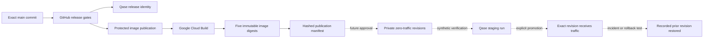

# Staging release control plane

## Decision

Samra Pay uses GitHub as the source and approval authority, Google Cloud Build
as the image builder, Artifact Registry as the immutable image store, Cloud Run
as the future runtime, and Qase as governed test evidence. These systems are
connected by exact identifiers. None of them may infer that a build, deployment,
test, traffic change, or vendor activation authorizes the next stage.

This contract is implemented through image publication. Zero-traffic deployment,
traffic promotion, and rollback automation remain prepared design boundaries and
are not yet authorized or live.

## Controlled delivery path

Solid arrows are implemented evidence flow. Dashed arrows are future controlled
mutations. No current workflow deploys Cloud Run or changes traffic.

## Stage authority

| Stage                   | Authority                    | Mutation                                       | Required evidence                                                                                | Current state                 |
| ----------------------- | ---------------------------- | ---------------------------------------------- | ------------------------------------------------------------------------------------------------ | ----------------------------- |
| Release candidate       | GitHub Actions               | None                                           | Exact `main` SHA, passing gates, Qase release identity                                           | Implemented                   |
| Image publication       | Protected GitHub environment | Cloud Build record and five immutable images   | Git SHA, Git tree, GitHub run, Cloud Build ID, five digests, manifest hash                       | Implemented                   |
| Zero-traffic deployment | Future protected environment | New private Cloud Run revisions at 0% traffic  | Approved manifest, migration execution, configuration hashes, revision names, zero-traffic proof | Not implemented or authorized |
| Staging verification    | Future controlled test run   | Synthetic test traffic only                    | Readiness, restart, service authentication, ledger, reconciliation, Qase run                     | Not implemented or authorized |
| Traffic promotion       | Future protected environment | Traffic moves to one exact revision            | Before/after traffic, approver, health evidence, rollback target                                 | Not implemented or authorized |
| Rollback                | Future protected environment | Traffic returns to one recorded prior revision | Reason, exact prior revision, restored traffic, post-rollback verification                       | Not implemented or authorized |

Building is not deployment. Deployment is not promotion. Passing tests is not
vendor activation. Each transition requires its own bounded authorization.

## Immutable publication evidence

`publish-staging-images.sh` creates the images and then calls
`record-staging-image-publication.mjs`. The recorder will fail unless all of the
following describe one release:

- full candidate Git SHA and Git tree SHA;
- private repository and `refs/heads/main` identity;
- GitHub workflow run ID, attempt, actor, and protected environment when GitHub
  performs the publication;
- regional Cloud Build UUID and dedicated keyless build identity;
- exact staging project, region, and immutable Artifact Registry repository;
- one immutable digest for each of the API, customer web, Operations Portal,
  design preview, and migrations images.

It writes:

- `artifacts/staging-release/staging-image-publication.json`; and
- `artifacts/staging-release/staging-image-publication.sha256`.

The protected publication workflow uploads both files as a GitHub artifact named
with the full commit, workflow run, and attempt. Retention is 365 days. The
manifest explicitly records that deployment, traffic, and vendor activation are
not authorized.

## Deployment design boundary

The next controller must consume an independently verified publication manifest
and deploy only by immutable digest. Its first release must:

- create private Cloud Run revisions for API, customer web, and design preview;
- use dedicated runtime identities and separate deployment federation;
- set new revisions to 0% traffic;
- disable default service URLs where the approved ingress design permits it;
- keep public unauthenticated IAM absent;
- pin secret versions rather than using `latest`;
- record configuration hashes, database migration execution, and revision names;
- fail closed when Auth0 staging configuration or customer-web service
  authentication is incomplete.

The Operations Portal remains blocked from deployment until workforce identity,
staff authorization, access review and revocation, and operations API security
are approved. Persona and Crossmint remain separate sandbox gates. No deployment
controller may activate either vendor.

## Promotion and rollback design boundary

Promotion must route traffic to an exact revision only after synthetic readiness,
service-authentication, ledger, reconciliation, and Qase evidence pass. The
controller must first persist the complete traffic allocation and the current
healthy revision as the rollback target.

Rollback must reassign traffic to that recorded revision. It must not rebuild an
old commit, resolve a floating tag, use a `latest` alias, or guess which revision
was previously healthy. Google Cloud Run supports explicit revision traffic
allocation through `gcloud run services update-traffic --to-revisions`; the
future controller will pin that command to the recorded revision and independently
verify the resulting allocation.

## Separation of identities

The existing GitHub federation provider is intentionally limited to the image
publication workflow and `staging-image-publication` environment. It must not be
broadened for deployment. The next phase requires a separate provider, protected
environment, service account, and least-privilege role for zero-traffic
deployment. Traffic promotion and rollback require another independently
reviewable permission boundary.

No Google service-account key or stored Google credential secret is permitted.
GitHub obtains short-lived credentials through workload identity federation.

## Operating evidence

For any revision that receives traffic, an operator must be able to answer these
questions from retained evidence without reading chat history:

1. Which exact Git commit and tree produced it?
2. Which GitHub run approved and published it?
3. Which Cloud Build produced each image digest?
4. Which migration execution and configuration hash preceded deployment?
5. Which Cloud Run revision received traffic, when, and by whose approval?
6. Which Qase run proved readiness and financial invariants?
7. Which prior revision is the tested rollback target?
8. Was rollback executed, and did post-rollback verification pass?

If any answer is missing, the release is not promotable.

## Source contracts

- `deploy/gcp/staging-release-control-plane.json`
- `deploy/gcp/validate-staging-release-control-plane.mjs`
- `deploy/gcp/record-staging-image-publication.mjs`
- `deploy/gcp/publish-staging-images.sh`
- `.github/workflows/staging-image-publication.yml`

Google references:

- [Deploying a new Cloud Run service or revision](https://cloud.google.com/sdk/gcloud/reference/run/deploy)
- [Managing Cloud Run traffic by revision](https://cloud.google.com/sdk/gcloud/reference/run/services/update-traffic)
- [Cloud Run rollouts, rollbacks, and traffic migration](https://cloud.google.com/run/docs/rollouts-rollbacks-traffic-migration)
